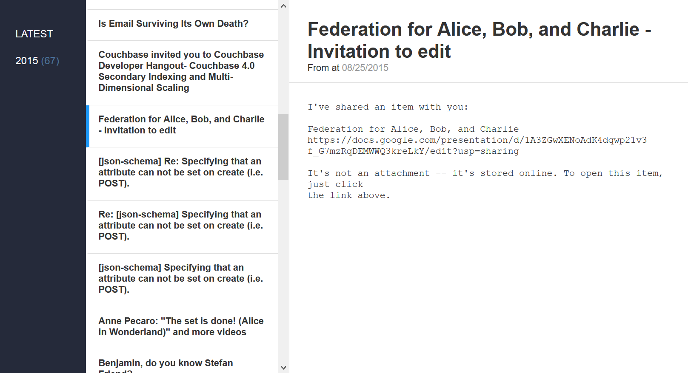

# couchmail.py

**Very** early stage email archiver for
[Apache CouchDB](http://couchdb.apache.org)
and [Cloudant](http://cloudant.com/).

Looks like this (so far):


## Installation

    $ pip install -r requirements.txt

#### Setup Apache CouchDB or Cloudant

Publishing the Design Doc / CouchApp to CouchDB is handled by a
`gulp` script, so it's as easy as...

    $ cp config.json.sample config.json
    $ # customize the config.json file
    $ npm install
    $ gulp

#### [Context.IO](http://context.io/)

This option requires a Context.IO Developer Account. Visit the
[Settings](https://console.context.io/#settings) section
of your account and get the API key & secret, then...

    $ cp config.contextio.sample.ini account-name.ini
    $ # customize the new .ini file
    $ python contextio.py account-name.ini

Hope for the best!

It *should* export the number of emails you specify,
store them by their `Message-ID` header value (or
timestamp...if `Message-ID` is missing).

**Note:** Checkout the `api` directories `README` if you want
to setup a basic email address obfuscator and UI.

#### IMAP via easyimap.py

`import.py` uses IMAP to connect to the mail server. See the Context.IO option below for something more...resilient.

    $ cp config.sample.ini account-name.ini
    $ # customize the new .ini file
    $ python import.py account-name.ini


#### Full-Text Search

The Design Doc includes basic MapReduce for counting things (see Futon,
Fauxton, or the Cloudant Dashboard for more). The UI for this is still in the
works--stay tuned! :radio:

It also includes some [Cloudant](http://cloudant.com/) specific Full-Text
Search indexes. These indexes let you search email addresses, subject lines,
and message bodies.

Here are some examples...

Search for "fauxton":

```
/couchdb-mailing-lists/_design/couchmail/_search/mail?q=fauxton
```

Count those results by `subject`, `to`, and `from`:

```
/couchdb-mailing-lists/_design/couchmail/_search/mail?q=fauxton&counts=["subject", "to", "from"]
```

Now drilldown those results to just what I've posted:

```
/couchdb-mailing-lists/_design/couchmail/_search/mail?q=fauxton&counts=["subject", "to", "from"]&drilldown=["from", "Benjamin Young <byoung@bigbluehat.com>"]
```

## License

[Apache License 2.0](http://www.apache.org/licenses/LICENSE-2.0.html)
